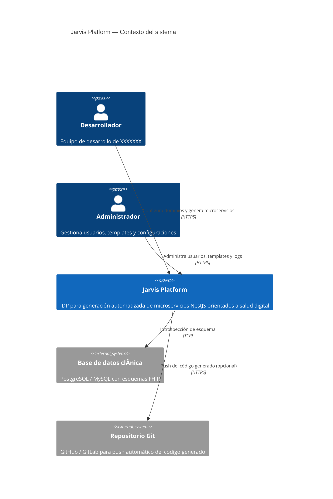
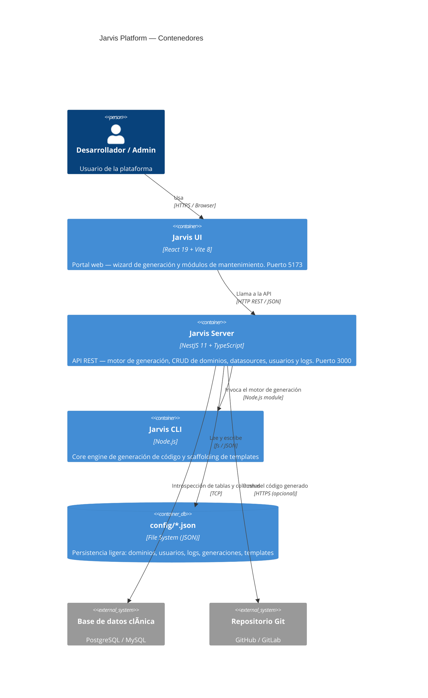
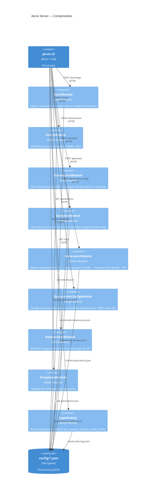
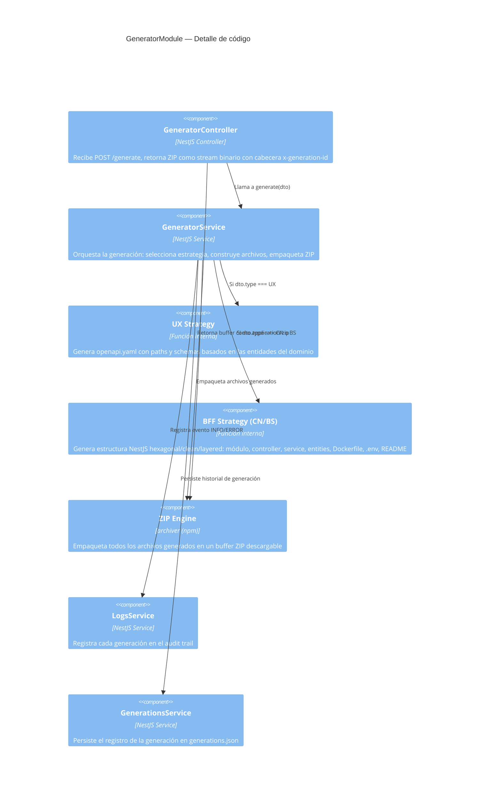

# Jarvis Platform

> Internal Developer Platform (IDP) para generación automatizada de microservicios NestJS orientados a salud digital.

**Autor:** XXXXXXX — Equipo de Arquitectura de Software  
**Proyecto:** Jarvis Platform  
**Versión:** 1.0.0

---

## Acerca del proyecto

Jarvis Platform es una plataforma de autoservicio para equipos de desarrollo de XXXXXXX. Permite generar microservicios NestJS completos a partir de la configuración de dominios clínicos, datasources y parámetros técnicos, sin necesidad de scaffolding manual.

Está inspirada en el concepto de IDP (Internal Developer Platform): estandarización de arquitectura, trazabilidad de generaciones y reducción del tiempo de bootstrap de nuevos servicios.

### Estrategias de generación

| Tipo | Estrategia | Salida |
|------|-----------|--------|
| `UX` | API First | `openapi.yaml` (contrato Swagger) |
| `CN` | BFF Canal | Microservicio NestJS de integración |
| `BS` | BFF Negocio | Microservicio NestJS con lógica clínica |

---

## Requisitos

| Herramienta | Versión |
|-------------|---------|
| Node.js     | 20.x+   |
| npm         | 10.x+   |
| NestJS CLI  | 11.x    |

---

## Estructura del monorepo

```
jarvis-platform/
├── jarvis-server/          # API NestJS — puerto 3000
│   ├── config/             # Persistencia JSON
│   ├── src/                # Módulos NestJS
│   └── README.md
├── jarvis-ui/              # Frontend React + Vite — puerto 5173
│   ├── src/
│   └── README.md
├── jarvis-cli/             # CLI de generación (core engine)
│   ├── commands/
│   ├── generators/
│   └── templates/
└── README.md               # Este archivo
```

---

## Instalación rápida

### Sin Docker (desarrollo local)

```bash
# Backend
cd jarvis-server
npm install
npm run start:dev   # http://localhost:10400

# Frontend (nueva terminal)
cd jarvis-ui
npm install
npm run dev         # http://localhost:10500
```

El frontend usa el proxy de Vite: las llamadas a `/api` se redirigen automáticamente a `localhost:10400`.

Accede a `http://localhost:10500` con `admin` / `admin123`.

---

## Docker

### Requisitos
- Docker Desktop (o Docker Engine + Compose Plugin)

### Puertos

| Servicio | Host | Interno |
|----------|------|---------|
| jarvis-ui (nginx) | `10500` | 80 |
| jarvis-server (NestJS) | `10400` | 3000 |

### Red Docker

La red `jarvis-net` es creada automáticamente por Docker Compose al hacer `up`. No es necesario crearla manualmente. Solo como referencia, el comando equivalente sería:

```bash
docker network create jarvis-net
```

Para ver las redes existentes:

```bash
docker network ls
```

### Primera vez

```bash
docker compose up --build -d
```

- UI: `http://localhost:10500` — usuario `admin` / `admin123`
- API (Swagger / Postman): `http://localhost:10400/api`

### Flujo normal con cambios en código

```bash
docker compose down
docker compose up --build -d
```

> La data **no se pierde** con estos comandos. El volumen `jarvis-config-data` persiste de forma independiente a los contenedores e imágenes.

### Otros comandos útiles

```bash
docker compose logs -f              # logs en tiempo real
docker compose logs -f jarvis-server
docker compose logs -f jarvis-ui
docker compose stop                 # detiene sin eliminar contenedores
docker compose up -d                # levanta sin rebuild
```

### Persistencia de datos

Toda la data (datasources, dominios, OpenAPI specs, historial, usuarios, templates) vive en el volumen Docker `jarvis-config-data`, montado en `/app/config` del contenedor.

| Acción | ¿Se pierde la data? |
|--------|-------------------|
| `docker compose stop` | No |
| `docker compose down` | No |
| `docker compose up --build` | No |
| `docker compose down --volumes` | **Sí** — borra el volumen |
| `docker volume rm jarvis-config-data` | **Sí** — borrado manual |

> **Regla:** nunca agregar `--volumes` al `down` salvo que se quiera resetear todo a cero.

### Backup

```bash
./backup.sh   # genera jarvis-backup-FECHA.tar.gz en el directorio actual
```

### Arquitectura Docker

```
Browser
  │
  ├── :10500  → jarvis-ui (nginx)
  │               ├── /        → archivos estáticos (React build)
  │               └── /api/*   → proxy interno → jarvis-server:3000
  │
  └── :10400  → jarvis-server (NestJS) — acceso directo para Postman/Swagger
```

Ambos servicios comparten la red interna `jarvis-net`. El proxy de nginx resuelve el backend por nombre de contenedor (`jarvis-server`), sin pasar por el host.

---

## Diagrama de arquitectura — C4 Model

### Nivel 1 — Contexto del sistema



---

### Nivel 2 — Contenedores



---

### Nivel 3 — Componentes (Jarvis Server)



---

### Nivel 4 — Código (GeneratorModule)



---

## Flujo de uso

```
Login
  │
  ├── Configuración
  │     ├── DataSources  → registrar conexiones BD
  │     ├── Domains      → definir entidades clínicas (estilo FHIR)
  │     ├── Templates    → gestionar catálogo de templates
  │     └── Users        → administrar equipo
  │
  └── Generación
        ├── Initialize   → wizard 5 pasos → descarga ZIP
        ├── Generations  → historial + re-descarga
        └── Logs         → audit trail completo
```

---

## Dominios sugeridos según HL7 FHIR R4

| Dominio | Entidades | Tipo |
|---------|-----------|------|
| Patient | Patient, RelatedPerson | BS |
| Encounter | Encounter, EpisodeOfCare | BS |
| Observation | Observation, DiagnosticReport | BS |
| Medication | Medication, MedicationRequest | BS |
| Appointment | Appointment, Schedule, Slot | CN |
| Practitioner | Practitioner, PractitionerRole | BS |
| Organization | Organization, Location | BS |
| Claim | Claim, ClaimResponse | BS |
| DocumentReference | DocumentReference, Composition | UX |
| Procedure | Procedure, ServiceRequest | BS |

> Referencia: [HL7 FHIR R4](https://hl7.org/fhir/R4/resourcelist.html)

---

## Documentación detallada

- [jarvis-server/README.md](./jarvis-server/README.md) — Manual técnico del backend
- [jarvis-ui/README.md](./jarvis-ui/README.md) — Manual de usuario del frontend

---

## Credenciales por defecto

```
usuario: admin
password: admin123
```

Definidas en `jarvis-server/config/security.json`.
