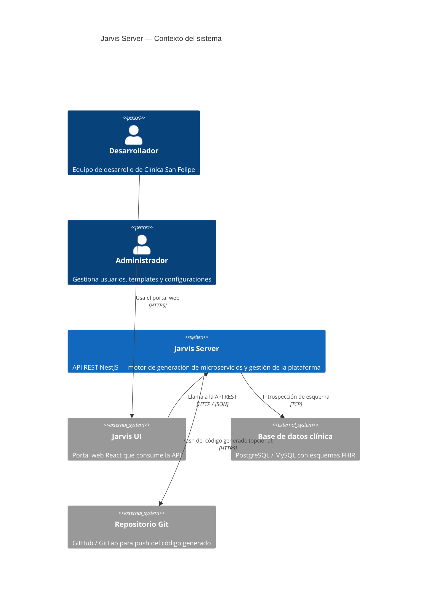
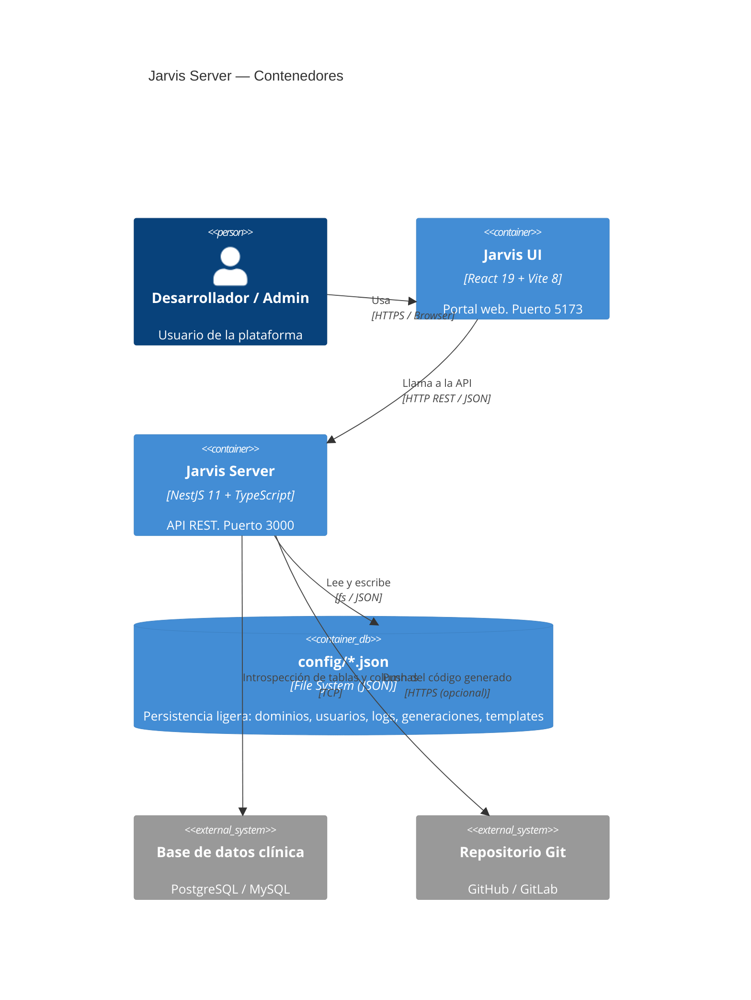
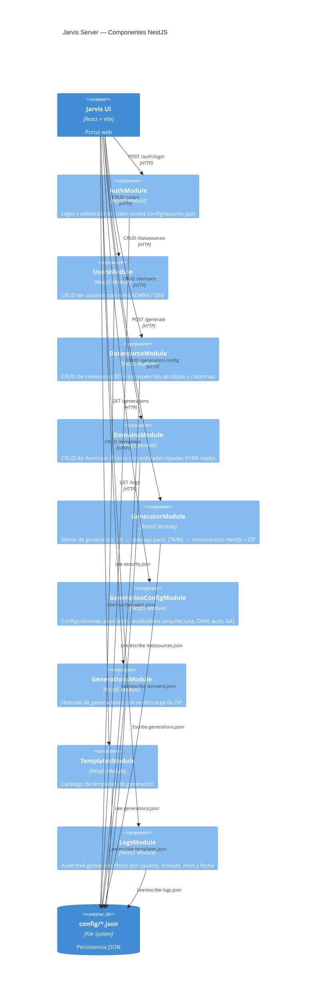
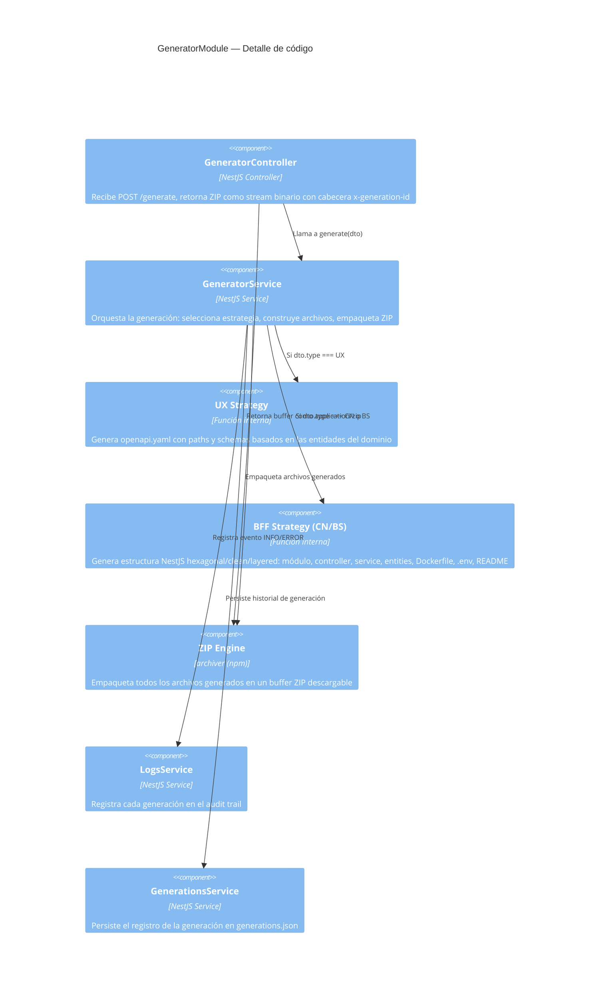

# Jarvis Server

> API backend de la plataforma Jarvis — Internal Developer Platform (IDP) para generación de microservicios NestJS.

**Autor:** Clínica San Felipe — Equipo de Arquitectura de Software  
**Versión:** 0.0.1  
**Stack:** NestJS 11 · TypeScript 5 · Node.js 20+

---

## Acerca del proyecto

Jarvis Server es el núcleo de la plataforma Jarvis. Expone una API REST que permite configurar dominios clínicos, datasources, templates y generar microservicios NestJS completos (código fuente + Dockerfile + .env + README + openapi.yaml) empaquetados en un archivo ZIP descargable.

Está diseñado bajo los principios de una IDP (Internal Developer Platform): autoservicio, trazabilidad y estandarización de arquitectura para equipos de desarrollo de salud digital.

---

## Requisitos

| Herramienta | Versión mínima |
|-------------|---------------|
| Node.js     | 20.x          |
| npm         | 10.x          |
| NestJS CLI  | 11.x          |

Bases de datos soportadas para introspección (opcional):

- PostgreSQL 13+
- MySQL 8+

---

## Instalación

```bash
cd jarvis-server
npm install
```

---

## Ejecución

```bash
# Desarrollo (watch mode)
npm run start:dev

# Producción
npm run build
npm run start:prod
```

El servidor levanta en `http://localhost:3000`.

---

## Estructura de carpetas

```
jarvis-server/
├── config/                     # Persistencia JSON (base de datos ligera)
│   ├── domains.json            # Dominios y entidades
│   ├── security.json           # Credenciales de acceso
│   ├── logs.json               # Audit trail
│   ├── users.json              # Usuarios de la plataforma
│   ├── templates.json          # Catálogo de templates
│   └── generations.json        # Historial de generaciones
├── src/
│   ├── app.module.ts           # Módulo raíz
│   ├── main.ts                 # Bootstrap + Swagger
│   ├── auth/                   # Autenticación básica
│   ├── users/                  # CRUD de usuarios
│   ├── datasource/             # CRUD + introspección de BD
│   ├── domains/                # CRUD de dominios y entidades
│   ├── generator/              # Motor de generación de código
│   ├── generation-config/      # Configuraciones avanzadas
│   ├── generations/            # Historial de generaciones
│   ├── templates/              # Catálogo de templates
│   └── logs/                   # Audit trail con filtros
├── nest-cli.json
├── tsconfig.json
└── package.json
```

---

## Diagrama de arquitectura — C4 Model

### Nivel 1 — Contexto del sistema



---

### Nivel 2 — Contenedores



---

### Nivel 3 — Componentes



---

### Nivel 4 — Código (GeneratorModule)



---

## Manual técnico — Módulos

### `auth`
Autenticación simple contra `config/security.json`.  
- `POST /auth/login` — recibe `{ username, password }`, retorna `{ token, user }`.  
- El token se adjunta como `Authorization: Bearer <token>` en cada request.

### `users`
CRUD de usuarios de la plataforma.  
- `GET /users` — lista todos los usuarios.  
- `POST /users` — crea usuario con rol `ADMIN` o `DEV`.  
- `PATCH /users/:id` — edita nombre, rol o estado activo/inactivo.  
- `DELETE /users/:id` — elimina usuario.  
- Persiste en `config/users.json`.

### `datasource`
CRUD de conexiones a bases de datos con introspección.  
- `GET /datasources` — lista datasources.  
- `POST /datasources` — registra nueva conexión.  
- `PATCH /datasources/:id` — actualiza.  
- `DELETE /datasources/:id` — elimina.  
- `GET /datasources/:id/tables` — conecta en tiempo real y retorna las tablas del schema `public`.  
- `GET /datasources/:id/tables/:table/columns` — retorna columnas de una tabla.

### `domains`
CRUD de dominios clínicos con entidades tipadas.  
- `GET /domains` — lista dominios.  
- `POST /domains` — crea dominio con entidades y campos tipados (`string`, `number`, `boolean`, `Date`).  
- `PATCH /domains/:id` — actualiza.  
- `DELETE /domains/:id` — elimina.  
- Migración automática de formato legacy (`entities: string[]` → `DomainEntity[]`).

### `generator`
Motor principal de generación de código.  
- `POST /generate` — recibe `GenerateDto`, genera el microservicio y retorna un ZIP.  
- Estrategias:
  - `UX` → genera solo `openapi.yaml` (API First).
  - `CN` / `BS` → genera microservicio NestJS completo con arquitectura hexagonal/clean/layered + Dockerfile + .env + README.
- Registra la generación en `config/generations.json`.
- Cabecera de respuesta: `x-generation-id`.

### `generation-config`
Configuraciones avanzadas reutilizables para generaciones.  
- `GET /generation-config` — lista configuraciones.  
- `POST /generation-config` — crea configuración (arquitectura, ORM, auth, observabilidad, Git).  
- `PATCH /generation-config/:id` — actualiza.  
- `DELETE /generation-config/:id` — elimina.

### `generations`
Historial de todas las generaciones realizadas.  
- `GET /generations` — lista historial.  
- `GET /generations/:id/download` — re-descarga el ZIP de una generación anterior.  
- `DELETE /generations/:id` — elimina registro.

### `templates`
Catálogo de templates disponibles para generación.  
- `GET /templates` — lista templates.  
- `POST /templates` — registra template (nombre, tipo, versión, path).  
- `PATCH /templates/:id` — actualiza.  
- `DELETE /templates/:id` — elimina.

### `logs`
Audit trail de todas las operaciones de la plataforma.  
- `GET /logs` — lista logs con filtros opcionales: `?user=&module=&level=&from=&to=`.  
- `DELETE /logs` — limpia el log completo.  
- Niveles: `INFO`, `WARN`, `ERROR`.

---

## Endpoints resumen

| Método | Ruta | Descripción |
|--------|------|-------------|
| POST | `/auth/login` | Login |
| GET/POST/PATCH/DELETE | `/users` | CRUD usuarios |
| GET/POST/PATCH/DELETE | `/datasources` | CRUD datasources |
| GET | `/datasources/:id/tables` | Introspección tablas |
| GET/POST/PATCH/DELETE | `/domains` | CRUD dominios |
| POST | `/generate` | Generar microservicio ZIP |
| GET/POST/PATCH/DELETE | `/generation-config` | CRUD configs avanzadas |
| GET | `/generations` | Historial generaciones |
| GET | `/generations/:id/download` | Re-descarga ZIP |
| GET/POST/PATCH/DELETE | `/templates` | CRUD templates |
| GET | `/logs` | Consulta audit trail |

---

## Variables de entorno

El servidor no requiere `.env` para funcionar en desarrollo. Para producción se recomienda:

```env
PORT=3000
NODE_ENV=production
```

---

## Credenciales por defecto

Definidas en `config/security.json`:

```
usuario: admin
password: admin123
```

---

## Dominios sugeridos según HL7 FHIR R4

| Dominio FHIR | Entidades principales | Tipo sugerido |
|---|---|---|
| **Patient** | Patient, RelatedPerson, Person | BS |
| **Encounter** | Encounter, EpisodeOfCare | BS |
| **Observation** | Observation, DiagnosticReport | BS |
| **Medication** | Medication, MedicationRequest, MedicationAdministration | BS |
| **Appointment** | Appointment, Schedule, Slot | CN |
| **Practitioner** | Practitioner, PractitionerRole | BS |
| **Organization** | Organization, Location, HealthcareService | BS |
| **Claim** | Claim, ClaimResponse, Coverage | BS |
| **DocumentReference** | DocumentReference, Composition | UX |
| **ImagingStudy** | ImagingStudy, ImagingSelection | UX |
| **AllergyIntolerance** | AllergyIntolerance, Condition | BS |
| **Procedure** | Procedure, ServiceRequest | BS |

> Referencia: [HL7 FHIR R4](https://hl7.org/fhir/R4/resourcelist.html)

---

## Flujo de uso

```
1. Login (admin/admin123)
        │
        ▼
2. Crear DataSource (conexión BD)
        │
        ▼
3. Crear Dominio + Entidades (ej: Patient con campos tipados)
        │
        ▼
4. Initialize → Wizard 5 pasos
   ├── Paso 1: Nombre + Tipo (UX/CN/BS) + Dominio
   ├── Paso 2: Arquitectura + ORM + Auth + Observabilidad + Git
   ├── Paso 3: DataSource + tablas disponibles
   ├── Paso 4: Preview de configuración
   └── Paso 5: Generar → descarga ZIP
        │
        ▼
5. Consultar Generations (historial + re-descarga)
        │
        ▼
6. Revisar Logs (audit trail)
```
