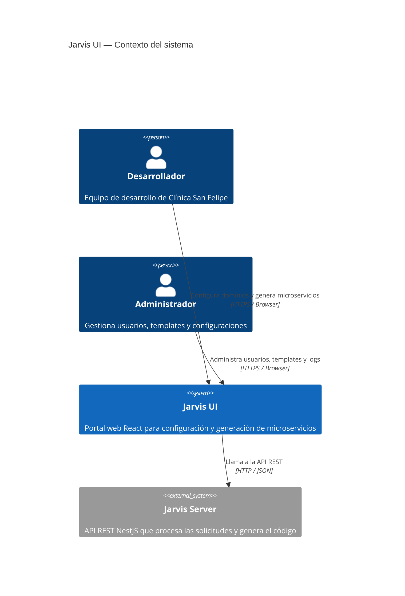
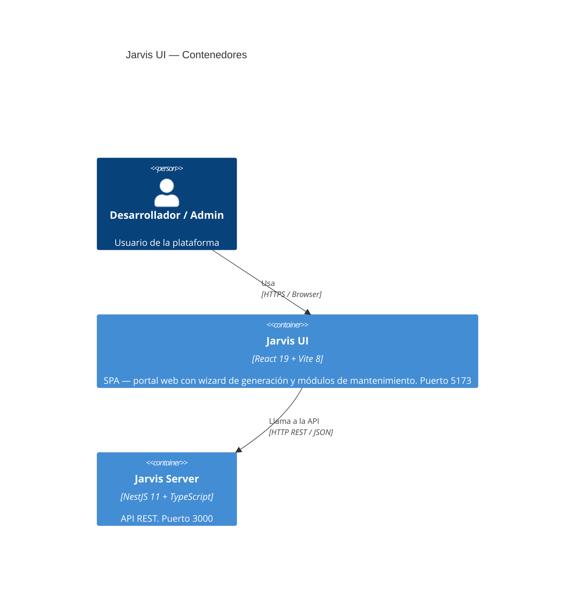
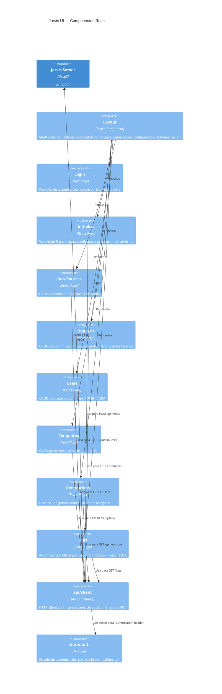
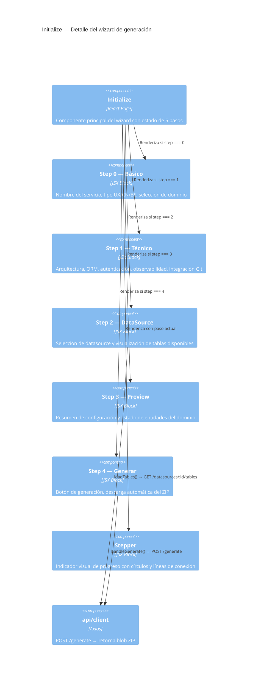

# Jarvis UI

> Interfaz web de la plataforma Jarvis — Internal Developer Platform (IDP) para generación de microservicios NestJS.

**Autor:** Clínica San Felipe — Equipo de Arquitectura de Software  
**Versión:** 0.0.0  
**Stack:** React 19 · Vite 8 · TypeScript 5 · lucide-react · react-router-dom v7

---

## Acerca del proyecto

Jarvis UI es el portal web de la plataforma Jarvis. Permite a los equipos de desarrollo de Clínica San Felipe configurar dominios clínicos, datasources y generar microservicios NestJS completos desde una interfaz visual, sin necesidad de usar la línea de comandos.

Paleta de colores institucional: `#003087` (azul Clínica San Felipe), `#ffffff` blanco, `#f4f6f9` gris claro.

---

## Requisitos

| Herramienta | Versión mínima |
|-------------|---------------|
| Node.js     | 20.x          |
| npm         | 10.x          |
| Jarvis Server | corriendo en :3000 |

---

## Instalación

```bash
cd jarvis-ui
npm install
```

---

## Ejecución

```bash
# Desarrollo
npm run dev
# → http://localhost:5173

# Build producción
npm run build
npm run preview
```

---

## Estructura de carpetas

```
jarvis-ui/
├── public/
│   ├── favicon.svg
│   └── icons.svg
├── src/
│   ├── api/
│   │   └── client.ts           # Axios instance con interceptores
│   ├── assets/
│   │   └── hero.png
│   ├── components/
│   │   ├── Btn.tsx             # Botón reutilizable (primary / ghost)
│   │   ├── Card.tsx            # Contenedor con sombra
│   │   └── Layout.tsx          # Shell principal con sidebar
│   ├── pages/
│   │   ├── Login.tsx           # Pantalla de autenticación
│   │   ├── Initialize.tsx      # Wizard de generación (5 pasos)
│   │   ├── DataSources.tsx     # CRUD datasources
│   │   ├── Domains.tsx         # CRUD dominios + editor de entidades
│   │   ├── Users.tsx           # CRUD usuarios
│   │   ├── Templates.tsx       # Catálogo de templates
│   │   ├── Generations.tsx     # Historial de generaciones
│   │   └── Logs.tsx            # Audit trail con filtros
│   ├── store/
│   │   └── auth.ts             # Estado de autenticación (localStorage)
│   ├── types/
│   │   └── index.ts            # Tipos TypeScript compartidos
│   ├── App.tsx                 # Router principal
│   ├── App.css
│   ├── index.css
│   └── main.tsx
├── index.html
├── vite.config.ts
└── package.json
```

---

## Diagrama de arquitectura — C4 Model

### Nivel 1 — Contexto del sistema



---

### Nivel 2 — Contenedores



---

### Nivel 3 — Componentes



---

### Nivel 4 — Código (Initialize — Wizard)



---

## Manual de usuario

### Login

Pantalla inicial de autenticación.

- Ingresa usuario y contraseña (por defecto: `admin` / `admin123`).
- Al autenticarse correctamente, se redirige al dashboard principal.
- El token se guarda en `localStorage` y se adjunta automáticamente a todas las peticiones.
- Si el token expira o es inválido, la app redirige al login automáticamente.

---

### Initialize — Wizard de generación

Flujo principal de la plataforma. Genera un microservicio completo en 5 pasos.

**Paso 1 — Datos básicos**
- Ingresa el nombre del servicio (ej: `patient-service`).
- Selecciona el tipo:
  - `UX — Diseño`: genera solo el contrato OpenAPI/Swagger (`openapi.yaml`). Estrategia API First.
  - `CN — Canal`: genera microservicio NestJS BFF de integración con sistemas externos.
  - `BS — Negocio`: genera microservicio NestJS BFF con lógica de negocio clínica.
- Selecciona el dominio clínico previamente creado.

**Paso 2 — Configuración técnica**
- Solo aplica para tipos CN y BS. Para UX se muestra un aviso informativo.
- Arquitectura: `Hexagonal` (Ports & Adapters), `Clean` o `Layered`.
- ORM: `Sin ORM`, `TypeORM` o `Prisma`.
- Autenticación: `Sin Auth`, `JWT` o `OAuth2`.
- Observabilidad: toggles para `Logs`, `Metrics`, `Tracing`.
- Integración Git: activa para configurar repo URL y branch destino.

**Paso 3 — DataSource**
- Selecciona un datasource registrado (opcional).
- Al seleccionar, se cargan automáticamente las tablas disponibles de la base de datos.
- Las tablas se muestran como chips informativos.

**Paso 4 — Preview**
- Resumen completo de la configuración antes de generar.
- Muestra: nombre del servicio, tipo, dominio, arquitectura, ORM, auth, datasource, Git.
- Lista las entidades del dominio seleccionado con el número de campos.

**Paso 5 — Generar**
- Botón "Generar y Descargar ZIP".
- El servidor genera el código y retorna un archivo `.zip` que se descarga automáticamente.
- El ZIP incluye: código fuente, `Dockerfile`, `.env`, `.env.example`, `README.md`, `openapi.yaml`.
- La generación queda registrada en el historial.

---

### DataSources

Gestión de conexiones a bases de datos.

- **Listar**: tabla con todas las conexiones registradas, estado y motor.
- **Crear**: formulario con campos engine (PostgreSQL/MySQL), host, puerto, usuario, contraseña, nombre de base de datos.
- **Editar**: modifica cualquier campo de la conexión.
- **Eliminar**: elimina la conexión (con confirmación).
- **Estado**: `active`, `failed`, `untested` — se actualiza al hacer introspección.

---

### Domains

Gestión de dominios clínicos con editor de entidades.

- **Listar**: tabla con dominios y número de entidades.
- **Crear / Editar**:
  - Nombre del dominio.
  - Editor de entidades estilo TypeScript: define entidades con campos tipados (`string`, `number`, `boolean`, `Date`) y marca si son requeridos (`?` = opcional).
  - Ejemplo de sintaxis en el editor:
    ```
    Patient {
      id: string
      name: string
      birthDate: Date
      address?: string
    }
    ```
- **Eliminar**: elimina el dominio y sus entidades.

---

### Users

Gestión de usuarios de la plataforma.

- **Listar**: tabla con usuario, rol y estado activo/inactivo.
- **Crear**: formulario con username, contraseña y rol (`ADMIN` o `DEV`).
- **Editar**: modifica rol o estado.
- **Activar / Desactivar**: toggle de estado sin eliminar el usuario.
- **Eliminar**: elimina el usuario permanentemente.

---

### Templates

Catálogo de templates de generación.

- **Listar**: tabla con nombre, tipo, versión y estado.
- **Crear**: registra un template con nombre, tipo (`nestjs`, `react`, etc.), versión y path.
- **Editar**: actualiza los metadatos del template.
- **Activar / Desactivar**: habilita o deshabilita el template para generación.
- **Eliminar**: elimina el template del catálogo.

---

### Generations

Historial de todas las generaciones realizadas.

- **Listar**: tabla con nombre del servicio, tipo, dominio, arquitectura, estado y fecha.
- **Estado**: `success` (verde), `failed` (rojo), `pending` (amarillo).
- **Re-descargar**: botón de descarga para volver a obtener el ZIP de una generación anterior.
- **Eliminar**: elimina el registro del historial.

---

### Logs

Audit trail de operaciones de la plataforma.

- **Listar**: tabla con timestamp, usuario, módulo, acción y nivel.
- **Filtros disponibles**:
  - Por usuario
  - Por módulo
  - Por nivel (`INFO`, `WARN`, `ERROR`)
  - Por rango de fechas (desde / hasta)
- **Limpiar logs**: elimina todo el historial de auditoría.
- Niveles con color: INFO (azul), WARN (naranja), ERROR (rojo).

---

## Componentes reutilizables

### `Btn.tsx`
Botón con dos variantes:
- `primary` (default): fondo `#003087`, texto blanco.
- `ghost`: fondo transparente, borde gris.

```tsx
<Btn onClick={fn}>Guardar</Btn>
<Btn variant="ghost" onClick={fn}>Cancelar</Btn>
<Btn disabled={loading}>Cargando...</Btn>
```

### `Card.tsx`
Contenedor con sombra suave y bordes redondeados. Envuelve el contenido de cada sección.

```tsx
<Card>
  <p>Contenido aquí</p>
</Card>
```

### `Layout.tsx`
Shell principal de la aplicación. Incluye:
- Sidebar colapsable con grupos: Generación, Configuración, Administración.
- Header con nombre de usuario y botón de logout.
- `<Outlet />` de react-router-dom para renderizar la página activa.

---

## `api/client.ts`

Instancia de Axios preconfigurada:
- `baseURL`: `http://localhost:3000`
- Interceptor de request: adjunta `Authorization: Bearer <token>` desde `localStorage`.
- Interceptor de response: si recibe `401`, limpia el token y redirige al login.

---

## `store/auth.ts`

Estado de autenticación persistido en `localStorage`:
- `getToken()` — retorna el token actual.
- `setToken(token)` — guarda el token.
- `clearToken()` — elimina el token (logout).
- `getUser()` — retorna el objeto usuario.

---

## `types/index.ts`

Tipos TypeScript compartidos que reflejan las interfaces del backend:

| Tipo | Descripción |
|------|-------------|
| `Domain` | Dominio clínico con entidades |
| `DomainEntity` | Entidad con nombre y campos |
| `EntityField` | Campo con nombre, tipo y required |
| `Datasource` | Conexión a base de datos |
| `User` | Usuario de la plataforma |
| `Template` | Template de generación |
| `Generation` | Registro de generación |
| `LogEntry` | Entrada de audit trail |
| `GenerateDto` | Payload del wizard de generación |

---

## Flujo de uso completo

```
1. Login (admin / admin123)
        │
        ▼
2. Configuración inicial
   ├── DataSources → registrar conexión BD
   └── Domains    → crear dominio + entidades tipadas
        │
        ▼
3. Initialize (Wizard)
   ├── Paso 1 → nombre + tipo (UX/CN/BS) + dominio
   ├── Paso 2 → arquitectura + ORM + auth + observabilidad
   ├── Paso 3 → datasource + tablas
   ├── Paso 4 → preview
   └── Paso 5 → generar → descarga ZIP automática
        │
        ▼
4. Post-generación
   ├── Generations → ver historial + re-descargar
   └── Logs        → revisar audit trail
```

---

## Dominios sugeridos según HL7 FHIR R4

| Dominio FHIR | Entidades principales | Tipo sugerido |
|---|---|---|
| **Patient** | Patient, RelatedPerson | BS |
| **Encounter** | Encounter, EpisodeOfCare | BS |
| **Observation** | Observation, DiagnosticReport | BS |
| **Medication** | Medication, MedicationRequest | BS |
| **Appointment** | Appointment, Schedule, Slot | CN |
| **Practitioner** | Practitioner, PractitionerRole | BS |
| **Organization** | Organization, Location | BS |
| **Claim** | Claim, ClaimResponse, Coverage | BS |
| **DocumentReference** | DocumentReference, Composition | UX |
| **AllergyIntolerance** | AllergyIntolerance, Condition | BS |
| **Procedure** | Procedure, ServiceRequest | BS |

> Referencia: [HL7 FHIR R4 Resource List](https://hl7.org/fhir/R4/resourcelist.html)
